# SpringCloudAlibaba  Admin

<p>
  <a href="https://github.com/luosuo3"></a>
  <a href="tencent://message/?Menu=yes&uin=718652232& Service=300&sigT=45a1e5847943b64c6ff3990f8a9e644d2b31356cb0b4ac6b24663a3c8dd0f8aa12a595b1714f9d45"></a>
  <a href="https://github.com/luosuo3/SpringCloudAlibaba-Gateway"></a>
  <a href="https://github.com/luosuo3/SpringCloudAlibaba-conten-center"></a>
  <a href="https://github.com/luosuo3/SpringCloudAlibaba-user-center"></a>
  <a href="https://github.com/luosuo3/SpringCloudAlibaba-Spring-Boot-Admin"></a>
</p>

## 微服务监控
## 如果部分图片加载不出来请使用科学上网方法
# 1.SpringCloudAlibaba 总体构架图


# 2.SpringCloudAlibaba 授权登录图


## (1)生成jwt让用户携带

* ```java
  public String generateToken(Map<String, Object> claims) {
      Date createdTime = new Date();
      Date expirationTime = this.getExpirationTime();
  
  
      byte[] keyBytes = secret.getBytes();
      SecretKey key = Keys.hmacShaKeyFor(keyBytes);
  
      return Jwts.builder()
              .setClaims(claims)
              .setIssuedAt(createdTime)
              .setExpiration(expirationTime)
              .signWith(key, SignatureAlgorithm.HS256)
              .compact();
  }
  ```

* chaims 用来传用户在jwt中所携带的信息，生成jwt然后返回给用户，前端将用户把生成的Token存到请求头中，比如 X-Token ：***

* ```java
  public String genToken() {
      Map<String, Object> userInfo = new HashMap<>(3);
      userInfo.put("id", 1);
      userInfo.put("wxNickname", "王峥");
      userInfo.put("role", "admin");
      return this.jwtOperator.generateToken(userInfo);
  }
  ```

* 比如存放我的名字还有我的用户权限”admin“

  

## (2)通过jwt进行授权认证

* 通过Spring AOP的思想新建两个注解 一个@ChecLogin 一个@CheckAuthorizationy一个检查登录的Token是否合法一个检查是否具有相应的权限例如User和Admin

* ```JAVA
  private void CheckToken() {
      try {
          //1.从header里面获取token
          HttpServletRequest request = getHttpServletRequest();
          String token = request.getHeader("X-Token");
          //2.校验token是否合法如果不合法,直接抛异常,合法就放行.
          Boolean isValidate = jwtOperator.validateToken(token);
          if (!isValidate) {
              throw new SecurityException("Token不合法");
          }
          //3.如果校验成功就把信息设置到request的attribute里面
          Claims claimsFromToken = jwtOperator.getClaimsFromToken(token);
          request.setAttribute("id",claimsFromToken.get("id"));
          request.setAttribute("wxNickname",claimsFromToken.get("wxNickname"));
          request.setAttribute("role",claimsFromToken.get("role"));
      } catch (SecurityException e) {
          throw new SecurityException("Token不合法!");
      }
  }
  ```

* ```java
   public Object checkAuthorization(ProceedingJoinPoint point) throws Throwable {
  //验证token是否合法
          try {
          this.CheckToken();
          HttpServletRequest httpServletRequest = this.getHttpServletRequest();
          String role = (String)httpServletRequest.getAttribute("role");
           MethodSignature signature = (MethodSignature)point.getSignature();
          Method method = signature.getMethod();
          CheckAuthorization  annotation = method.getAnnotation(CheckAuthorization.class);
          String value = annotation.value();
          if (!Objects.equals(role, value)) {
              throw new SecurityException("用户无权访问!");
          }
  
          } catch (Throwable throwable) {
              throw new SecurityException("用户无权访问!", throwable);
          }
          return point.proceed();
  
      }
  ```

  检验授权的代码主要在检验登录的前提下多了从注解的Value里里获取值，再和请求头中所解析出来的用户的RULE是否相同。

* ```java
  /**
   * @author 王峥
   * @date 2020/6/29 9:44 上午
   */
  @RestController
  @RequestMapping("/admin/shares")
  public class ShareAdminController {
      @Resource
      private ShareService shareService;
  
      @PutMapping("/audit/{id}")
      @CheckAuthorization("admin")
      public Share auditById(@PathVariable Integer id, @RequestBody ShareAuditDTO auditDTO) {
  //        TODO 认证和授权
          return shareService.auditById(id, auditDTO);
      }
  }
  ```

  在需要认证授权的API上加上@@CheckAuthorization("admin")注解，就会在访问时候来执行上述类方法获取其中的Value来和用户的Role参数进行比较。

## (3)jwt的配置

* ```yaml
  jwt:
    secret: fafasdfsdfasdfasdffadsfdasfasdfas
    # 有效期，单位秒，默认2周
    expire-time-in-second: 1209600
  ```

* ```java
  <dependency>
      <groupId>io.jsonwebtoken</groupId>
      <artifactId>jjwt-jackson</artifactId>
      <version>0.10.7</version>
      <scope>runtime</scope>
  </dependency>
  ```

* 首先引入相关依赖然后再yaml文件中配置相关设置，其中secret代表解密密钥所有微服务必须一致，否则会jwt会解密出不同的数据。expire-time-in-second代表有效时间，jwt和session不一样它是不可控的。

# 3.Gateway转发网关

## (1).添加依赖

```java
<dependency>
   <groupId>org.springframework.cloud</groupId>
   <artifactId>spring-cloud-starter-gateway</artifactId>
</dependency>
```

## (2).添加配置

```yaml
    gateway:
      discovery:
        locator:
          #          通过服务发现组件找到其他的微服务
          lower-case-service-id: true
          enabled: true
      routes:
        - id : user_route
          uri: lb://user-center
          predicates:
            - Path=/users/**
#            - TimeBetween=上午7:00,下午5:00
        - id: content_route
          uri: lb://content-center
          predicates:
            - Path=/shares/**,/admin/**
#          filters:
#            - AddRequestHeader=X-Request-Foo, Bar
#            - PreLog=a,b
```

* 首先配置gateway可以从注册中心可以找到所有注册的服务，从而实现自动转发lb：代表从服务中心找到服务并且转发。predicates为断言也就是符合的条件- Path为路径条件- TimeBetween是在什么时间之内。 filters是过滤器分为”pre“和”post“一个在请求前一个在响应后启用。-AddRequestHeader=X-Request-Foo, Bar是过滤请求头为X-Request且值为Bar的请求。

* ```java
  /**
   * @author 王峥
   * @date 2020/7/2 10:03 上午
   */
  @Component
  public class TimeBetweenRoutePredicateFactory extends AbstractRoutePredicateFactory <TimeBeweenConfig>{
  
  
      public TimeBetweenRoutePredicateFactory() {
          super(TimeBeweenConfig.class);
      }
  
      @Override
      public Predicate<ServerWebExchange> apply(TimeBeweenConfig config) {
          LocalTime start = config.getStart();
          LocalTime end = config.getEnd();
          return exchange -> {
              LocalTime now = LocalTime.now();
              return now.isAfter(start) && now.isBefore(end);
          };
      }
  //配置类的映射关系
      //
      @Override
      public List<String> shortcutFieldOrder() {
          return Arrays.asList("start","end");
      }
  }
  ```

* 以上是定义断言的配置类代码

* ```java
  @Slf4j
  @Component
  public class PreLogGatewayFilterFactory extends AbstractNameValueGatewayFilterFactory {
      @Override
      public GatewayFilter apply(NameValueConfig config) {
          return  (exchange, chain) -> {
              log.info("请求进来了,name:{},value:{}", config.getName(), config.getValue());
  
              ServerHttpRequest modemyRequest = exchange.getRequest()
                      .mutate()
                      .build();
              ServerWebExchange modefyExchange = exchange.mutate()
                      .request(modemyRequest)
                      .build();
              return chain.filter(modefyExchange);
          };
      }
  }
  ```

  

* 以上是自定义过滤器配置类代码

# 4.Nacos服务中心与配置中心

## (2).服务中心

* ```java
  <dependency>
      <groupId>com.alibaba.cloud</groupId>
      <artifactId>spring-cloud-alibaba-nacos-discovery</artifactId>
      <version>2.1.0.RELEASE</version>
  </dependency>
  ```

  添加依赖 

* ```yaml
  nacos:
    discovery:
      server-addr: localhost:8848
      #        namespace: 5aee0e1b-51f7-414b-908b-c773f389b047
      cluster-name: BEIJING
  ```

  添加配置，server-addr是服务发现地址，namespace为工作空间，cluster-name为集群名字。

* 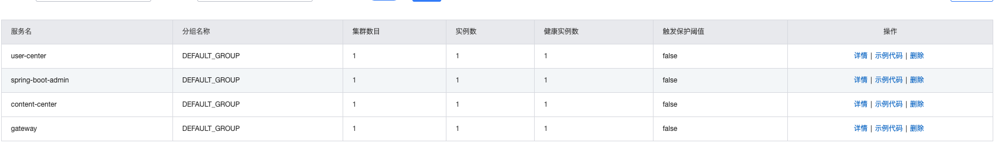

  这时候Nacos服务中心就会看到各个微服务注册的情况

* 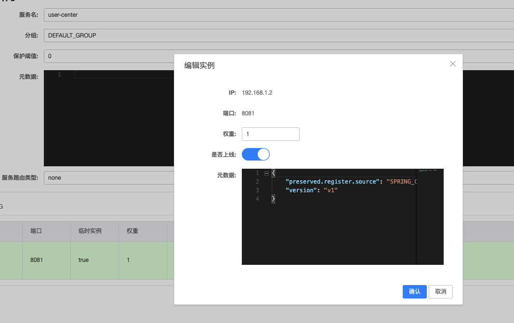

​       同时可以设置权重数字越小权重越大，还有流量保护阈值。也可以自己设置元数据，元数据代表自定义标签结构为k-v。可以通过Nacos的api获取从而得到元数据做一些逻辑处理。

* ```java
  /**
   * @author 王峥
   * @date 2020/6/24 9:15 下午
   */
  @Slf4j
  public class NacosFinalRule extends AbstractLoadBalancerRule {
      @Resource
      private NacosDiscoveryProperties nacosDiscoveryProperties;
  
  
      @Override
      public Server choose(Object o) {
          // 负载均衡规则：优先选择同集群下，符合metadata的实例
          // 如果没有，就选择所有集群下，符合metadata的实例
  
          // 1. 查询所有实例 A
          // 2. 筛选元数据匹配的实例 B
          // 3. 筛选出同cluster下元数据匹配的实例 C
          // 4. 如果C为空，就用B
          // 5. 随机选择实例
          try {
              String clusterName = this.nacosDiscoveryProperties.getClusterName();
              String targetVersion = this.nacosDiscoveryProperties.getMetadata().get("target-version");
  
              DynamicServerListLoadBalancer loadBalancer = (DynamicServerListLoadBalancer) getLoadBalancer();
              String name = loadBalancer.getName();
  
              NamingService namingService = this.nacosDiscoveryProperties.namingServiceInstance();
  
              // 所有实例
              List<Instance> instances = namingService.selectInstances(name, true);
  
              List<Instance> metadataMatchInstances = instances;
              // 如果配置了版本映射，那么只调用元数据匹配的实例
              if (StringUtils.isNotBlank(targetVersion)) {
                  metadataMatchInstances = instances.stream()
                          .filter(instance -> Objects.equals(targetVersion, instance.getMetadata().get("version")))
                          .collect(Collectors.toList());
                  if (CollectionUtils.isEmpty(metadataMatchInstances)) {
                      log.warn("未找到元数据匹配的目标实例！请检查配置。targetVersion = {}, instance = {}", targetVersion, instances);
                      return null;
                  }
              }
  
              List<Instance> clusterMetadataMatchInstances = metadataMatchInstances;
              // 如果配置了集群名称，需筛选同集群下元数据匹配的实例
              if (StringUtils.isNotBlank(clusterName)) {
                  clusterMetadataMatchInstances = metadataMatchInstances.stream()
                          .filter(instance -> Objects.equals(clusterName, instance.getClusterName()))
                          .collect(Collectors.toList());
                  if (CollectionUtils.isEmpty(clusterMetadataMatchInstances)) {
                      clusterMetadataMatchInstances = metadataMatchInstances;
                      log.warn("发生跨集群调用。clusterName = {}, targetVersion = {}, clusterMetadataMatchInstances = {}", clusterName, targetVersion, clusterMetadataMatchInstances);
                  }
              }
  
              Instance instance = ExtendBalancer.getHostByRandomWeight2(clusterMetadataMatchInstances);
              return new NacosServer(instance);
          } catch (Exception e) {
              log.warn("发生异常", e);
              return null;
          }
      }
  
      @Override
      public void initWithNiwsConfig(IClientConfig iClientConfig) {
      }
  
  
      static class ExtendBalancer extends Balancer {
          public static Instance getHostByRandomWeight2(List<Instance> hosts) {
              return getHostByRandomWeight(hosts);
          }
      }
  }
  ```

  通过namingService.selectInstances获取实例，instance.getMetadata().get("version")获取相应的元数据从而进行一系列的逻辑操作。getHostByRandomWeight2是返回了Nacos基于权重的负载均衡算法。主要的流程：

  ​        // 1. 查询所有实例 A
  ​        // 2. 筛选元数据匹配的实例 B
  ​        // 3. 筛选出同cluster下元数据匹配的实例 C
  ​        // 4. 如果C为空，就用B
  ​        // 5. 随机选择实例

  

## (2)配置中心

* ```java
  <dependency>
      <groupId>org.springframework.cloud</groupId>
      <artifactId>spring-cloud-alibaba-nacos-config</artifactId>
      <version>0.9.0.RELEASE</version>
  </dependency>
  ```

  引入依赖

* 新建一个bootstrap.yml配置文件用来程序引导时执行，应用于更加早期配置信息读取。主要更早的从Nacos配置中心加载的配置

* ```yaml
  spring:
    cloud:
      nacos:
        config:
          server-addr: 127.0.0.1:8848
          file-extension: yaml
    application:
      name: content-center
    profiles:
      active: dev
  ```

​       配置好配置服务地址，还有文件扩展名，Nacos通过文件扩展名来识别在云端写的配置文件name+active+file-extension为云端配置的DATA名字。如下所示。

* 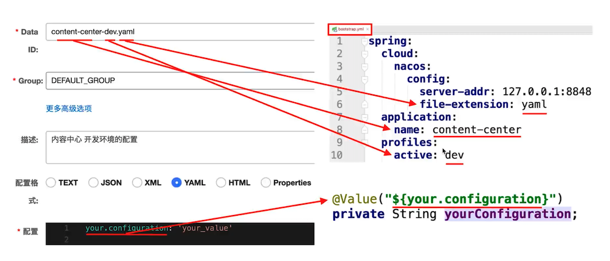

* 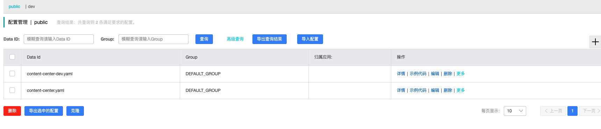

​         这是对用户中心采用的云端配置，如果直接以微服务名字命名不带-dev则表示通用配置。

* 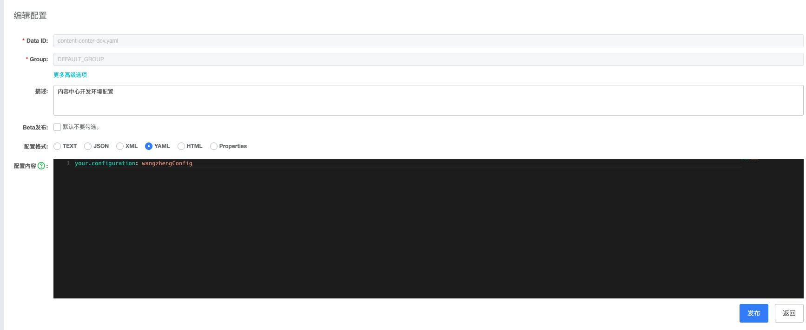

​       在配置中心编写内容中心所需要的配置。

# 5.RoketMQ消息中间件

## (1).RoketMQ分布式事务构架图


## (2).利用Spring-Cloud-Stream进行分布式消息传递

* 引入依赖

```java
<dependency>
    <groupId>org.springframework.cloud</groupId>
    <artifactId>spring-cloud-starter-stream-rocketmq</artifactId>
    <version>0.9.0.RELEASE</version>
</dependency>
```

* 添加配置

  ```yaml
  stream:
    rocketmq:
      binder:
        name-server: 127.0.0.1:9876
      bindings:
        output:
          producer:
            transactional: true
            group: tx-add-bonus-group
    bindings:
      output:
        #          指定topic
        destination: add-bonus
  ```

  output代表生产者，input代表消息订阅者，transactional打开RocketMQ的分布式事务，bindings是连接的消息驱动。destination: add-bonus指定了topic相当于消息广播的频道。

* 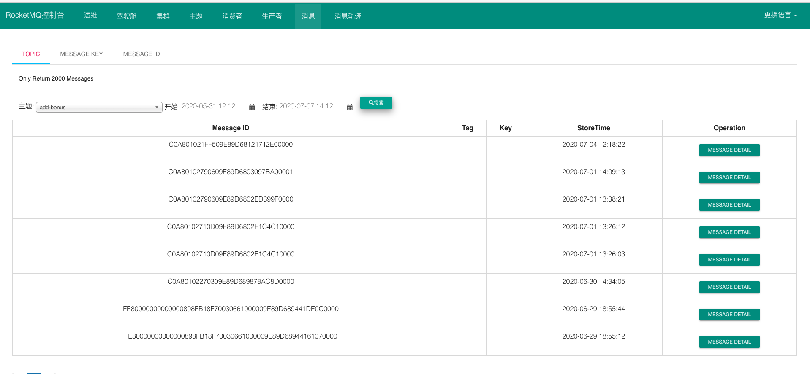

​          单独运行RockeMQ可视化控制台可以清晰的看到产生的消息以及查询消息消费的轨迹。

* 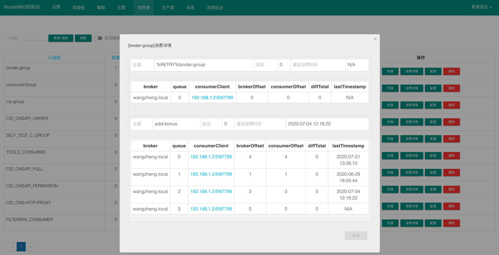

* 分布式消息的本地事务的代码，开启分布式消息会先发送半消息到MQServer判断消息服务是否可用，然后请求到本地事务判断是提交还是回滚。

* 首先受到请求的时候会通过SpringCloudStream的方式发送消息到MqServer但是不进行消费后期通过本地事务来判断之后的操作

* ```java
  this.source.output()
              .send(
                      MessageBuilder.withPayload(
                              UserAddBonusMsgDTO.builder()
                                      .userId(share.getUserId())
                                      .bonus(50)
                                      .build()
                      )
                              .setHeader(RocketMQHeaders.TRANSACTION_ID, transactionId)
                              .setHeader("share_id", id)
                              .setHeader("dto", JSON.toJSONString(auditDTO))
                              .build()
              );
  } else {
      //        审核资源,将状态设为PASS/REJECT
      auditByIdInDB(auditDTO, id);
  }
  ```

  这里就是想MqServer发送了一个添加积分信息的消息体，发送请求后程序会到重写的本地事务方法中去。

* ```java
  /**
   * @author 王峥
   * @date 2020/6/30 10:17 上午
   */
  @RocketMQTransactionListener(txProducerGroup = "tx-add-bonus-group")
  @Slf4j
  public class AddBonusTransactionListenner implements RocketMQLocalTransactionListener {
      @Resource
      private RocketmqTransactionLogMapper rocketmqTransactionLogMapper;
      @Resource
      private ShareService shareService;
  
      @Override
      public RocketMQLocalTransactionState executeLocalTransaction(Message message, Object o) {
          MessageHeaders headers = message.getHeaders();
          Integer shareId = Integer.valueOf((String) headers.get("share_id"));
          String transactionid = (String) headers.get(RocketMQHeaders.TRANSACTION_ID);
          String dtoString = (String) headers.get("dto");
          ShareAuditDTO shareAuditDTO = JSON.parseObject(dtoString, ShareAuditDTO.class);
          log.info("id={}", shareId);
          try {
              shareService.auditByIdInDB(shareAuditDTO, shareId);
              shareService.auditByIdWithRocketMqLog(shareId, shareAuditDTO, transactionid);
              return RocketMQLocalTransactionState.COMMIT;
          } catch (Exception e) {
              return RocketMQLocalTransactionState.ROLLBACK;
          }
      }
  
      @Override
      public RocketMQLocalTransactionState checkLocalTransaction(Message message) {
          MessageHeaders headers = message.getHeaders();
          String transactionid = (String) headers.get(RocketMQHeaders.TRANSACTION_ID);
          RocketmqTransactionLogExample rocketmqTransactionLogExample = new RocketmqTransactionLogExample();
          rocketmqTransactionLogExample.createCriteria().andTransactionIdEqualTo(transactionid);
          List<RocketmqTransactionLog> rocketmqTransactionLogs = this.rocketmqTransactionLogMapper.selectByExample(rocketmqTransactionLogExample);
          if (rocketmqTransactionLogs.get(0) != null) {
              return RocketMQLocalTransactionState.COMMIT;
          } else {
              return RocketMQLocalTransactionState.ROLLBACK;
          }
      }
  }
  ```

* executeLocalTransaction代表执行本地事务的方法，手续爱你通过消息请求头获得当前操作DTO的id以及消息的id作为记录，shareService.auditByIdInDB表示消息的具体操作这里表示测试的功能更新审核状态，auditByIdWithRocketMqLog这个方法代表上一个事务操作成功后向数据库添加日志记录当前操作已经执行成功。不抛异常就可以执行COMMIT提交操作了让消费者去消费消息添加积分（这里的添加积分是自定义的一个测试功能会传到用户中心去操作测试消息传递是否正常）否则就是ROLLBACK回滚。

* RocketMQLocalTransactionState代表检查本地事务的方法，也就是架构图的6.检查本地操作事务，当MqServer一直没有收到COMMIT或者ROLLBACK就会去会查，看看事务到底执行了没有，通过什么来检查呢就是auditByIdWithRocketMqLog方法所添加的日志。通过消息请求头获取消息体唯一的TRANSACTION_ID来查询日志数据库中有没有相关的日志，如果有就相当于本地事务已经执行成功了可以进行COMMIT提交操作，否则执行ROLLBACK回滚。

* ```java
  /**
   * @author 王峥
   * @date 2020/6/30 9:27 下午
   */
  @Service
  @Slf4j
  public class AddBonusStreamConsumer {
      @Resource
      private UserService userService;
  
      @StreamListener(Sink.INPUT)
      public void receive(UserAddBonusMsgDTO message) {
          message.setDescription("投稿加积分!");
          message.setEvent("CONTRIBUTE");
          this.userService.addBonus(message);
      }
  
  
  }
  ```

* 当提交成功时候订阅的消费者就可以通过获得消息体执行相关的操作，这里就是用户中心获取消息体的信息，并且执行添加积分操作。

* 用户中心微服务的配置

  ```yaml
   stream:
      rocketmq:
        binder:
          name-server: 127.0.0.1:9876
      bindings:
        input:
          destination: add-bonus
          #           rocketmq 必须设置
          group: binder-group
  #        namespace:  5aee0e1b-51f7-414b-908b-c773f389b047
  #      cluster-name: BEIJING
  ```

  topic必须设置和内容中心一致！destination: add-bonus。

* 

* 

# 6.Feigin和Ribbon实现跨域请求和负载均衡

##  (1)Ribbon实现负载均衡

* 引入依赖

  ```java
  <dependency>
      <groupId>org.springframework.cloud</groupId>
      <artifactId>spring-cloud-starter-openfeign</artifactId>
  </dependency>
  ```

​      Feigin依赖里整合了Ribbon这里直接引入Feigin就可以了。

* ```yaml
  ribbon:
    eager-load:
      enabled: true
      #    对user-center饥饿加载
      clients: user-center
  ```

  添加配置开启对微服务的饥饿加载，否则默认调用的时候才加载延迟较大。

* ```java
  @Configuration
  public class RibbonConfig {
      @Bean
      public IRule ribbonRule() {
          return new NacosSameClusterWeightedRule();
  //        return new NacosWeightedRule();
  //        return new RandomRule();
      }
  ```

​      配置类配置负载均衡的方法默认为轮询,这里引用的是Nacos的基于权重的负载均衡方法。

* 

​               Ribbon可选的负载均衡配置。

## (2).Feigin微服务之间发送请求

* 引入依赖

```java
<dependency>
    <groupId>org.springframework.cloud</groupId>
    <artifactId>spring-cloud-starter-openfeign</artifactId>
</dependency>
```

```
<dependency>
    <groupId>io.github.openfeign</groupId>
    <artifactId>feign-okhttp</artifactId>
    <version>10.1.0</version>
</dependency>
```

* 添加配置

```yaml
feign:
  httpclient:
    enabled: false
    max-connections: 200
    max-connections-per-route: 50
  okhttp:
    enabled: true
```

添加okttp支持

* Feigin统一异常处理 FallbackFactory

```java
/**
 * @author 王峥
 * @date 2020/6/27 9:38 下午
 */
@Component
@Slf4j
public class UserCenterFeignClientFallbackFactory implements FallbackFactory<UserCenterFeignClient> {
    @Override
    public UserCenterFeignClient create(Throwable throwable) {
        return new UserCenterFeignClient() {
            @Override
            public UserDTO findById(Integer id) {
                log.warn("远程调用被限流或者降级了!", throwable);
                UserDTO userDTO = new UserDTO();
                userDTO.setWxNickname("一个测试用户");
                return userDTO;
            }

            @Override
            public UserDTO addBonus(UserAddBonusDTO userAddBonusDTO) {
                log.warn("远程调用被限流或者降级了!", throwable);
                return null;
            }
        };
    }
}
```

主要整合Sentinel的时候限流和降级的时候进行日志显示

* ```java
  @FeignClient(name = "user-center", fallbackFactory = UserCenterFeignClientFallbackFactory.class)
  public interface UserCenterFeignClient {
  
      @GetMapping("/users/{id}")
      UserDTO findById(@PathVariable Integer id);
  
      @PutMapping("/users/add-bonus")
      UserDTO addBonus(@RequestBody UserAddBonusDTO userAddBonusDTO);
  
  }
  ```

​       name为微服务的名字，新建了两个请求一个GET查询用户一个PUT增加积分。Feigin主要以接口的形式调用。 

```java
UserDTO userDTO = this.userCenterFeignClient.findById(userId);
 this.userCenterFeignClient.addBonus(
                UserAddBonusDTO.builder()
                        .userId(userId)
                        .bonus(0-share.getPrice())
                        .build()
        );
```

相关的引用方法，这样既可以建立请求到其他微服务上，并且带有负载均衡的效果。

# 7.Sentinel轻量级流量控制框架

## (1)Sentinel实现簇点链路的降级以及流量控制

* 引入依赖

  ```java
  <dependency>
      <groupId>com.alibaba.cloud</groupId>
      <artifactId>spring-cloud-starter-alibaba-sentinel</artifactId>
      <version>2.2.1.RELEASE</version>
  </dependency>
  ```

* 添加配置

  ```yaml
  sentinel:
    filter:
      url-patterns: /**
      #        暂时打开对 Sping MVC 端点的保护
      enabled: true
    transport:
      #        指定控制台sentinel的地址
      dashboard: localhost:8080yaml
     
  ```

  ```yaml
  feign:
    sentinel:
      #    为Feign整合sentinel
      enabled: true
  ```

  为Feigin开启Sentinel监控

* 

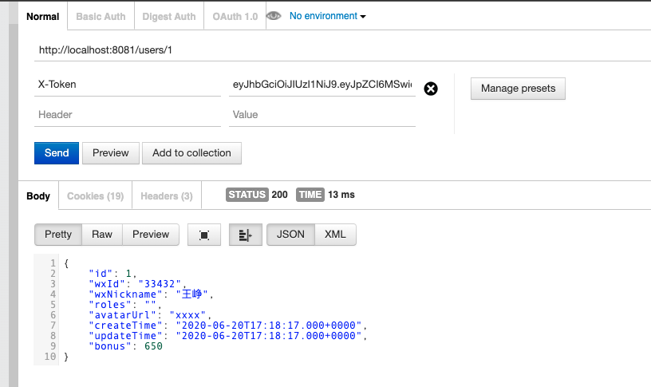

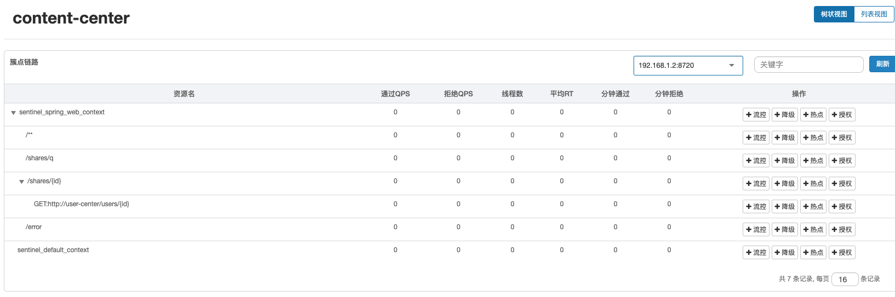

访问http://localhost:8081/users/1并且携带token就可以访问到用户信息，这时候在打开Sentinel控制台就会有端点记录。

* 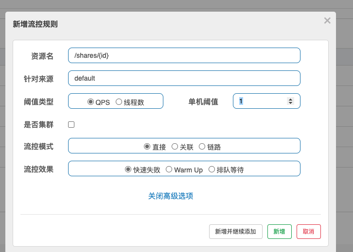

新增流控条件QPS不超过1，也就是每秒查询数不超过1。

* 

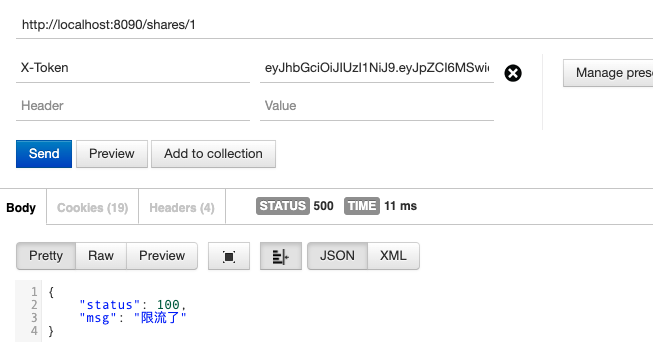

超过设置值访问失败提示已经被限流了。说明Sentinel的配置是生效的可以对一些特🆙的情况进行限流或者 降级操作，对于一些秒杀或者一些流量激增的场景可以用Sentinel进行调控。

## (2)Sentinel配置文件持久化

* 引入依赖

```java
<dependency>
    <groupId>com.alibaba.csp</groupId>
    <artifactId>sentinel-datasource-extension</artifactId>
</dependency>
```

配置拉模式将Sentinel的配置文件存储到本地

* 添加配置代码

  ```java
  public class FileDataSourceInit implements InitFunc {
      @Override
      public void init() throws Exception {
          // TIPS: 如果你对这个路径不喜欢，可修改为你喜欢的路径
          String ruleDir = System.getProperty("user.home") + "/sentinel/rules";
          String flowRulePath = ruleDir + "/flow-rule.json";
          String degradeRulePath = ruleDir + "/degrade-rule.json";
          String systemRulePath = ruleDir + "/system-rule.json";
          String authorityRulePath = ruleDir + "/authority-rule.json";
          String paramFlowRulePath = ruleDir + "/param-flow-rule.json";
  
          this.mkdirIfNotExits(ruleDir);
          this.createFileIfNotExits(flowRulePath);
          this.createFileIfNotExits(degradeRulePath);
          this.createFileIfNotExits(systemRulePath);
          this.createFileIfNotExits(authorityRulePath);
          this.createFileIfNotExits(paramFlowRulePath);
  
          // 流控规则
          ReadableDataSource<String, List<FlowRule>> flowRuleRDS = new FileRefreshableDataSource<>(
                  flowRulePath,
                  flowRuleListParser
          );
          // 将可读数据源注册至FlowRuleManager
          // 这样当规则文件发生变化时，就会更新规则到内存
          FlowRuleManager.register2Property(flowRuleRDS.getProperty());
          WritableDataSource<List<FlowRule>> flowRuleWDS = new FileWritableDataSource<>(
                  flowRulePath,
                  this::encodeJson
          );
          // 将可写数据源注册至transport模块的WritableDataSourceRegistry中
          // 这样收到控制台推送的规则时，Sentinel会先更新到内存，然后将规则写入到文件中
          WritableDataSourceRegistry.registerFlowDataSource(flowRuleWDS);
  
          // 降级规则
          ReadableDataSource<String, List<DegradeRule>> degradeRuleRDS = new FileRefreshableDataSource<>(
                  degradeRulePath,
                  degradeRuleListParser
          );
          DegradeRuleManager.register2Property(degradeRuleRDS.getProperty());
          WritableDataSource<List<DegradeRule>> degradeRuleWDS = new FileWritableDataSource<>(
                  degradeRulePath,
                  this::encodeJson
          );
          WritableDataSourceRegistry.registerDegradeDataSource(degradeRuleWDS);
  
          // 系统规则
          ReadableDataSource<String, List<SystemRule>> systemRuleRDS = new FileRefreshableDataSource<>(
                  systemRulePath,
                  systemRuleListParser
          );
          SystemRuleManager.register2Property(systemRuleRDS.getProperty());
          WritableDataSource<List<SystemRule>> systemRuleWDS = new FileWritableDataSource<>(
                  systemRulePath,
                  this::encodeJson
          );
          WritableDataSourceRegistry.registerSystemDataSource(systemRuleWDS);
  
          // 授权规则
          ReadableDataSource<String, List<AuthorityRule>> authorityRuleRDS = new FileRefreshableDataSource<>(
                  authorityRulePath,
                  authorityRuleListParser
          );
          AuthorityRuleManager.register2Property(authorityRuleRDS.getProperty());
          WritableDataSource<List<AuthorityRule>> authorityRuleWDS = new FileWritableDataSource<>(
                  authorityRulePath,
                  this::encodeJson
          );
          WritableDataSourceRegistry.registerAuthorityDataSource(authorityRuleWDS);
  
          // 热点参数规则
          ReadableDataSource<String, List<ParamFlowRule>> paramFlowRuleRDS = new FileRefreshableDataSource<>(
                  paramFlowRulePath,
                  paramFlowRuleListParser
          );
          ParamFlowRuleManager.register2Property(paramFlowRuleRDS.getProperty());
          WritableDataSource<List<ParamFlowRule>> paramFlowRuleWDS = new FileWritableDataSource<>(
                  paramFlowRulePath,
                  this::encodeJson
          );
          ModifyParamFlowRulesCommandHandler.setWritableDataSource(paramFlowRuleWDS);
      }
  
      private Converter<String, List<FlowRule>> flowRuleListParser = source -> JSON.parseObject(
              source,
              new TypeReference<List<FlowRule>>() {
              }
      );
      private Converter<String, List<DegradeRule>> degradeRuleListParser = source -> JSON.parseObject(
              source,
              new TypeReference<List<DegradeRule>>() {
              }
      );
      private Converter<String, List<SystemRule>> systemRuleListParser = source -> JSON.parseObject(
              source,
              new TypeReference<List<SystemRule>>() {
              }
      );
  
      private Converter<String, List<AuthorityRule>> authorityRuleListParser = source -> JSON.parseObject(
              source,
              new TypeReference<List<AuthorityRule>>() {
              }
      );
  
      private Converter<String, List<ParamFlowRule>> paramFlowRuleListParser = source -> JSON.parseObject(
              source,
              new TypeReference<List<ParamFlowRule>>() {
              }
      );
  
      private void mkdirIfNotExits(String filePath) throws IOException {
          File file = new File(filePath);
          if (!file.exists()) {
              file.mkdirs();
          }
      }
  
      private void createFileIfNotExits(String filePath) throws IOException {
          File file = new File(filePath);
          if (!file.exists()) {
              boolean newFile = file.createNewFile();
          }
      }
  
      private <T> String encodeJson(T t) {
          return JSON.toJSONString(t);
      }
  }
  ```

  网上找的生成配置数据文件的代码，引入依赖后会自动生成配置的json数据。

##  (3)Sentinel异常统一处理

* ```java
  @Component
  public class MyBlockExceptionHandler implements BlockExceptionHandler {
      @Override
      public void handle(HttpServletRequest request, HttpServletResponse response, BlockException ex) throws Exception {
          ErrorMsg msg = new ErrorMsg();
          if (ex instanceof FlowException) {
              msg = ErrorMsg.builder()
                      .status(100)
                      .msg("限流了")
                      .build();
          } else if (ex instanceof DegradeException) {
              msg = ErrorMsg.builder()
                      .status(101)
                      .msg("降级了")
                      .build();
          } else if (ex instanceof ParamFlowException) {
              msg = ErrorMsg.builder()
                      .status(102)
                      .msg("热点参数限流")
                      .build();
          } else if (ex instanceof SystemBlockException) {
              msg = ErrorMsg.builder()
                      .status(103)
                      .msg("系统规则（负载/...不满足要求）")
                      .build();
          } else if (ex instanceof AuthorityException) {
              msg = ErrorMsg.builder()
                      .status(104)
                      .msg("授权规则不通过")
                      .build();
          }
          // http状态码
          response.setStatus(500);
          response.setCharacterEncoding("utf-8");
          response.setHeader("Content-Type", "application/json;charset=utf-8");
          response.setContentType("application/json;charset=utf-8");
          // spring mvc自带的json操作工具，叫jackson
          new ObjectMapper()
                  .writeValue(
                          response.getWriter(),
                          msg
                  );
  
      }
  }
  
  @Data
  @Builder
  @AllArgsConstructor
  @NoArgsConstructor
  class ErrorMsg {
      private Integer status;
      private String msg;
  }
  ```

  新建内部类ErrorMsg有状态码和异常信息，实现BlockExceptionHandler的接口针对每一个限制规则来判断抛出什么异常从而返回不同的状态码以及对应的异常信息例如：

  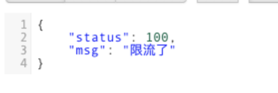

# 8.SpringBootAdmin将自带的监控数据可视化

## (1)整合SpringBootActuator

```java
<dependency>
    <groupId>org.springframework.boot</groupId>
    <artifactId>spring-boot-starter-actuator</artifactId>
</dependency>
```

```yaml
management:
  endpoints:
    web:
      exposure:
        include: '*'
```

```java
<dependency>
    <groupId>de.codecentric</groupId>
    <artifactId>spring-boot-admin-dependencies</artifactId>
    <version>${spring-boot-admin.version}</version>
    <type>pom</type>
    <scope>import</scope>
</dependency>
```

暴露所有端口用于数据监测，SpringBootAdmin就是将SpringBootActuator返回的json数据变成可视化的界面

## (2).启动SpringBootAdmin

* 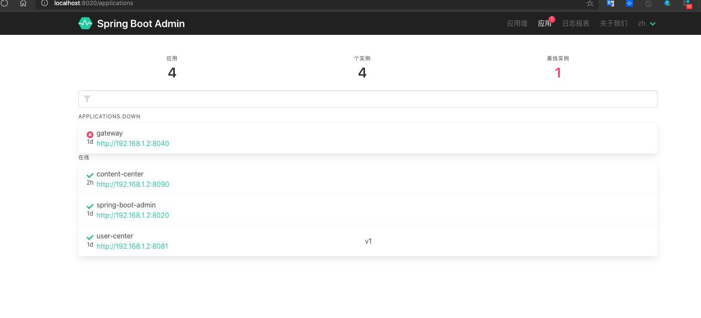

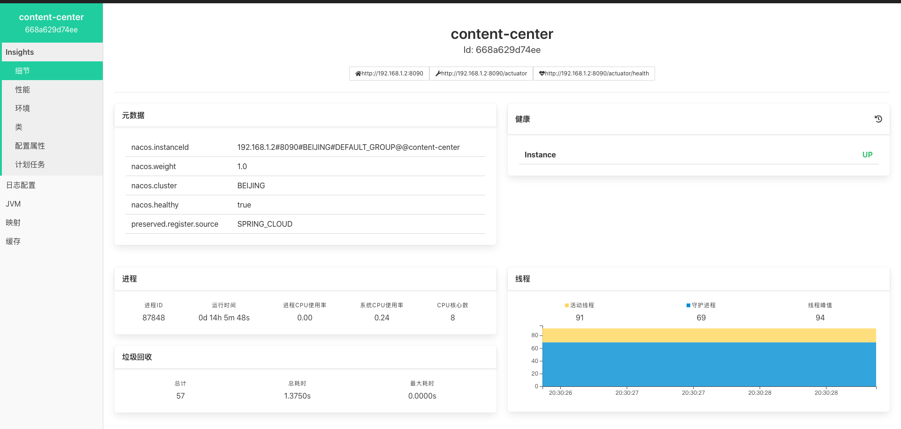

启动后可以请求接口的性能和健康情况。每一个服务或者接口都具有心跳机制来反馈当前的健康状态。

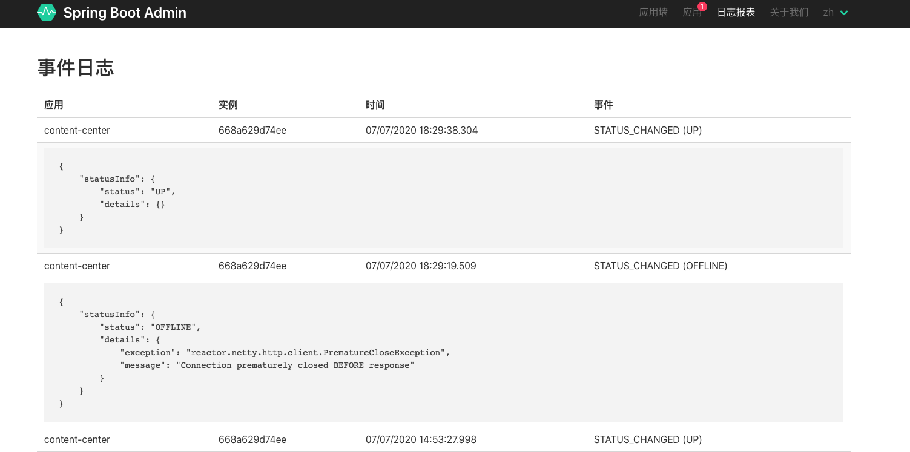

也可以看到每个服务接口的日志。

# 9.Zipkin+Sleuth+Elasticsearch链路追踪

* 引入依赖

  ```java
  <dependency>
      <groupId>org.springframework.cloud</groupId>
      <artifactId>spring-cloud-starter-zipkin</artifactId>
  </dependency>
  ```

​       Zipkin依赖中自带Sleuth依赖

* 编写配置

```yaml
zipkin:
  base-url: http://localhost:9411/
  discovery-client-enabled: false
  sleuth:
    sampler:
      #      抽样率不丢失任何数据达到100%
      #      建议默认0.1不会影响性能
      probability: 1.0
```

抽样率设置的100%应为测试数据量小一般为10%

* 启动Zipkin

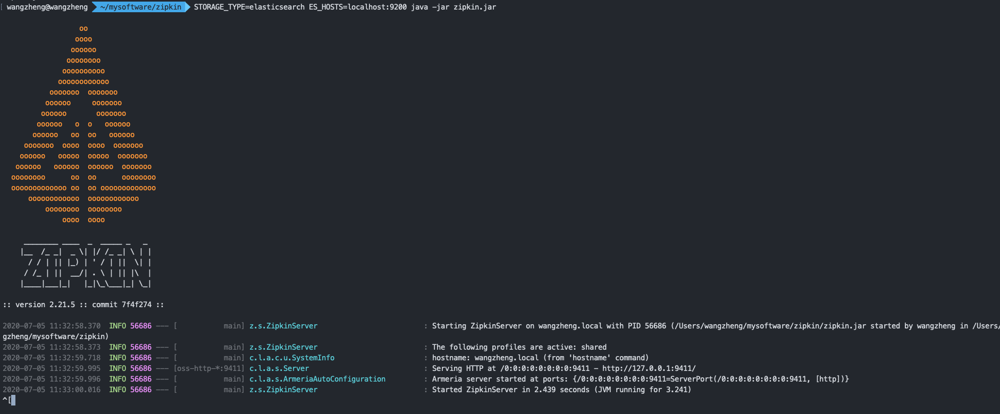

启动时添加配置存储日志信息用的是Elasticsearch 服务地址为localhost:9200

* 启动Elasticsearch

  

​     启动Elasticsearch默认端口9200

* 利用Zipkin可视化分析链路数据

  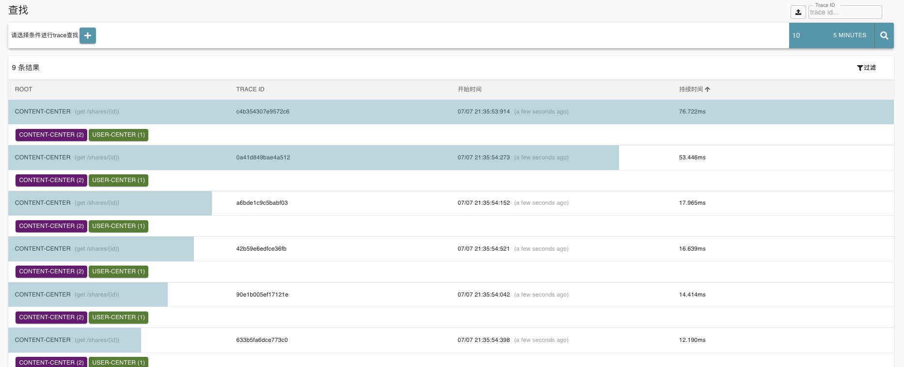

​      可以看到访问API时候各个服务的调用情况，图中显示了从内容中心到用户中心的路径以及耗时。

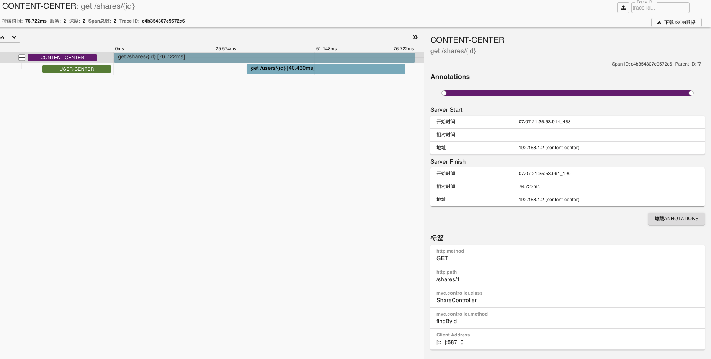

点进去可以看到详细信息，这样在微服务过多且API过多的时候可以快速找到出错的地方，出错会变红，从而达到链路追踪的效果。